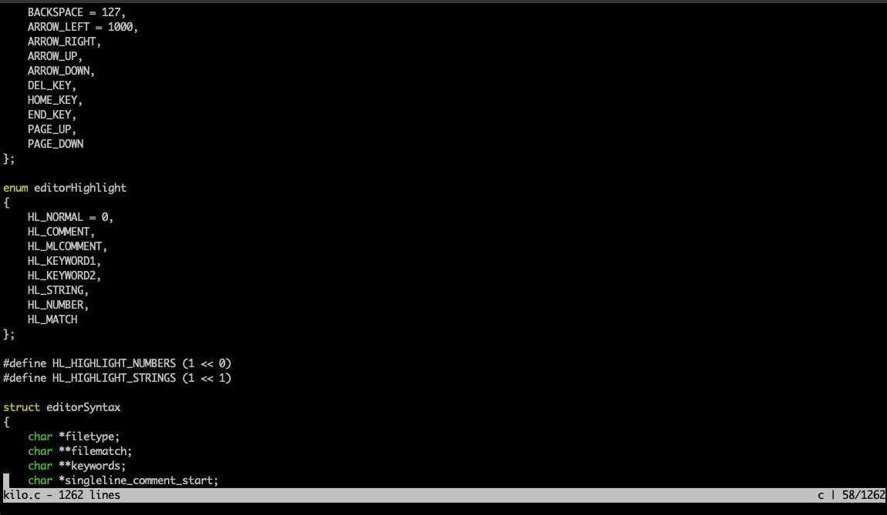

### <p align="center">build-kilo-c</p>
#### <p align="center">编译一个自己的编辑器</p>
#### <p align="center"><a href="https://github.com/jeffcail/build-kilo-c/releases"></a><a href="https://github.com/jeffcail/build-kilo-c/blob/master/LICENSE"></a><p>
#### <p align="center"><a href="./README.md" target="_blank">简体中文</a> | <a href="./README_en.md" target="_blank">English</a> </p>




> Build Your Own Text Editor https://viewsourcecode.org/snaptoken/kilo/


#### 下载安装
mac
```shell
curl -sSL https://raw.githubusercontent.com/jeffcail/build-kilo-c/refs/heads/master/install.sh | bash
```
